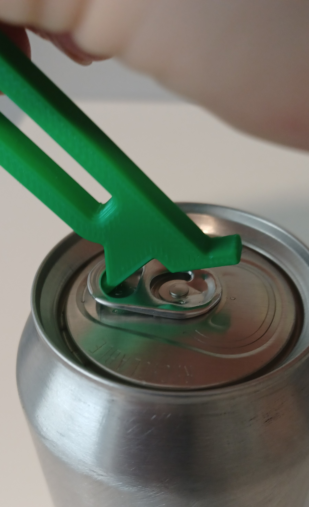

# Printlab Beverage Can Opener
A tool to open beverage cans with a simple hook and lever motion.

## More info at
- [Makers Making Change Project Page](https://makersmakingchange.com/project/beverage-can-opener-from-printlab/)
- [Makers Making Change Forum Thread](https://makersmakingchange.com/forum/topic/printlab-beverage-can-opener/)

## How to Obtain a Printlab Beverage Can Opener
### 1. Do it Yourself (DIY) or Do it Together (DIT)

This is an open-source assistive technology, so anyone is free to build it. All of the files and instructions required to build the Printlab Beverage Can Opener are contained within this repository. Refer to the Maker Checklist below.

### 2. Request a build of this device

If you would like to obtain a Printlab Beverage Can Opener , you may submit a build request through the [MMC Library Page](https://makersmakingchange.com/project/beverage-can-opener-from-printlab/). The requestor is responsible for the cost of materials and any shipping.

### 3. How to build this device for someone else

If you have the skills and equipment to build this device, and would like to donate your time to create the switch for someone who needs it, visit the [MMC Maker Wanted](https://makersmakingchange.com/maker-wanted/) section.

## Getting Started

### 1. Read the [Makers Checklist](/Documentation/Printlab_Beverage_Opener_Maker_Checklist_V1.0.pdf)

The Makers Checklist 

### 2. Print the Device

All of the print files can be in the [/Build_Files/3D_Printing_Files](/Build_Files/3D_Printing/) folder.

Detailed instructions about 3D Printing settings can be found in the [3D Printing Guide](/Documentation/Printlab_Beverage_Opener_3D_Printing_Guide_V1.0.pdf)

## Files
### Documentation
| Document             | Version | Link |
|----------------------|---------|------|
| Design Rationale     | 1.0     | [Printlab_Beverage_Opener_Design_Rationale](/Documentation/Printlab_Beverage_Opener_Design_Rationale_V1.0.pdf)     |
| Maker Checklist      | 1.0     | [Printlab_Beverage_Opener_Maker_Checklist](/Documentation/Printlab_Beverage_Opener_Maker_Checklist_V1.0.pdf)     |
| Bill of Materials    | 1.0     | [Printlab_Beverage_Opener_Bill_of_Materials](/Documentation/Printlab_Beverage_Opener_BOM_V1.0.csv)     |
| 3D Printing Guide    | 1.0     | [Printlab_Beverage_Opener_3D_Printing_Guide](/Documentation/Printlab_Beverage_Opener_3D_Printing_Guide_V1.0.pdf)     |
| User Guide           | 1.0     | [Printlab_Beverage_Opener_User_Guide](/Documentation/Printlab_Beverage_Opener_User_Guide_V1.0.pdf)    |
| Changelog            | 1.0     | [Printlab_Beverage_Opener_Changelog](/Documentation/Printlab_Beverage_Opener_Changelog_V1.0.pdf)     |

### Design Files
[CAD Files](/Design_Files)

### Build Files
[3D Printing Files](/Build_Files/3D_Printing)

## Attribution
Original design by Jason Yeung.
Minor modifications to design and documentation by Neil Squire / Makers Making Change under the CC-BY-SA 4.0 License.
More information about Printlab can be found on their website: https://weareprintlab.com/  under the CC-BY-SA 4.0 License.

## License
Everything needed or used to design, make, test, or prepare the Printlab Beverage Can Opener is licensed under the CERN 2.0 Permissive license <https://ohwr.org/project/cernohl/wikis/Documents/CERN-OHL-version-2> (CERN-OHL-P) . 

 <Device-Name> by <a xmlns:cc="http://creativecommons.org/ns#" href="www.makersmakingchange.com" property="cc:attributionName" rel="cc:attributionURL">Neil Squire</a> is licensed under a <a rel="license" href="http://creativecommons.org/licenses/by-sa/4.0/">Creative Commons Attribution-ShareAlike 4.0 International License</a>.

## About Us

Makers Making Change is an initiative of [Neil Squire](https://www.neilsquire.ca/), a Canadian non-profit that helps people with disabilities.

We are committed to creating a network of volunteer makers who support people with disabilities in their communities through 3D printing assistive devices. Check out our library of free, open-source assistive technologies with parts and build instructions.

 - Website: [www.MakersMakingChange.com](https://www.makersmakingchange.com/)
 - GitHub: [https://github.com/makersmakingchange](https://github.com/makersmakingchange)
 - Twitter: [@makermakechange](https://twitter.com/makermakechange)
 - Instagram: [@makersmakingchange](https://www.instagram.com/makersmakingchange)

## How you can get involved
1. Help design a solution 

1. 
3.

## Contact Us

For technical questions, to get involved, or share your experience we encourage you to visit the [MMC Website](https://www.makersmakingchange.com/), [MMC Forum](https://makersmakingchange.com/forum), or contact info@makersmakingchange.com
